# 🏗️ Django Ecommerce API Architecture

This document provides a comprehensive overview of the Django Ecommerce API architecture, including system design, data flow, and component interactions.

## 📋 Table of Contents

- [System Overview](#system-overview)
- [Architecture Patterns](#architecture-patterns)
- [Core Components](#core-components)
- [Data Flow](#data-flow)
- [API Design](#api-design)
- [Database Design](#database-design)
- [Security Architecture](#security-architecture)
- [Deployment Architecture](#deployment-architecture)

## 🎯 System Overview

The Django Ecommerce API is built using modern architectural patterns to ensure scalability, maintainability, and performance.

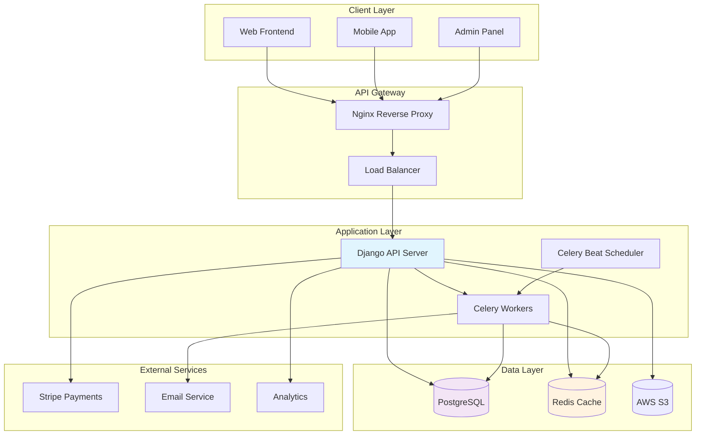

## 🔧 Architecture Patterns

### 1. Layered Architecture

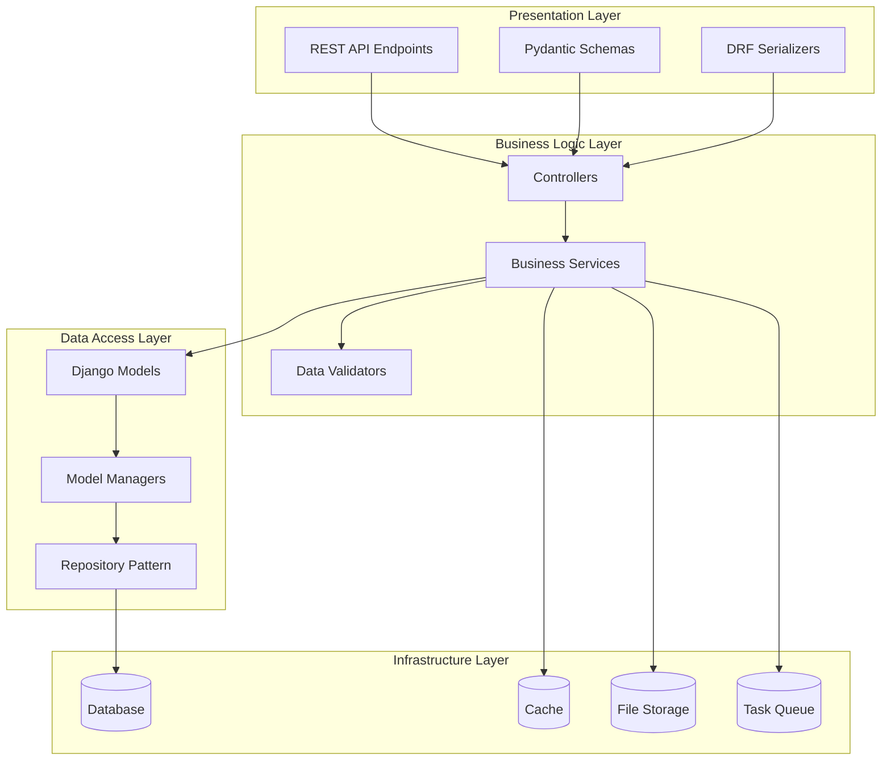

### 2. Domain-Driven Design (DDD)

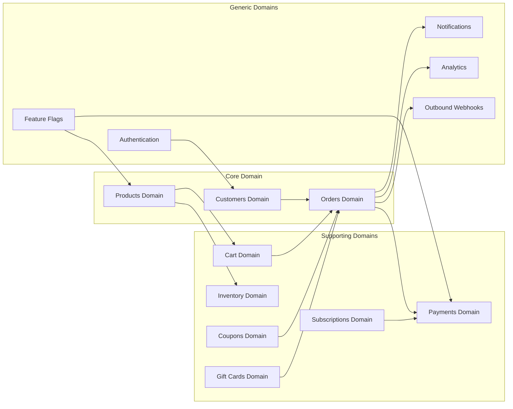

## 🧩 Core Components

### Application Structure

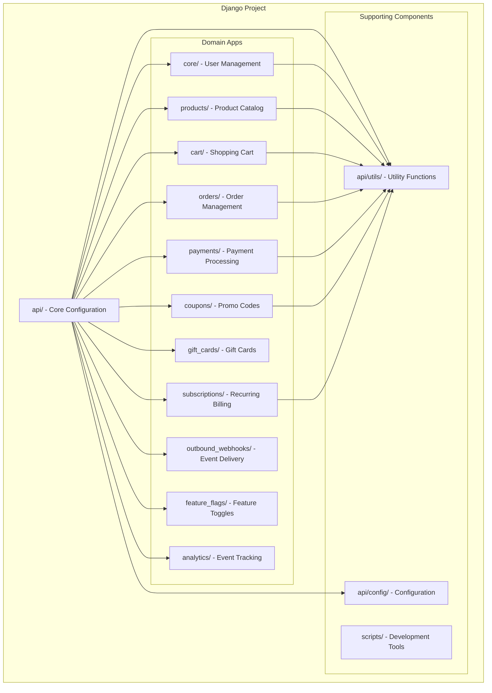

### Model Architecture

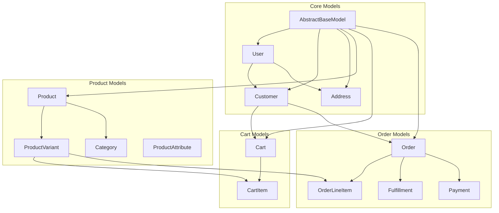

## 🌊 Data Flow

### Order Processing Flow

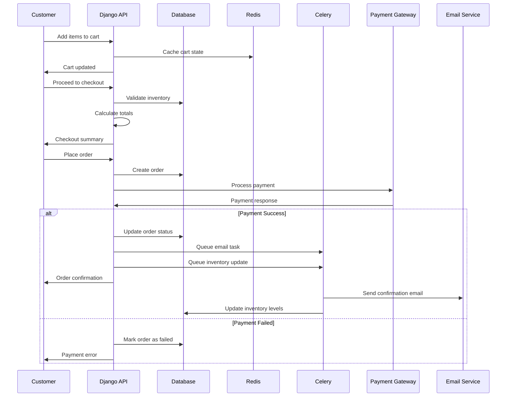

### Product Search Flow

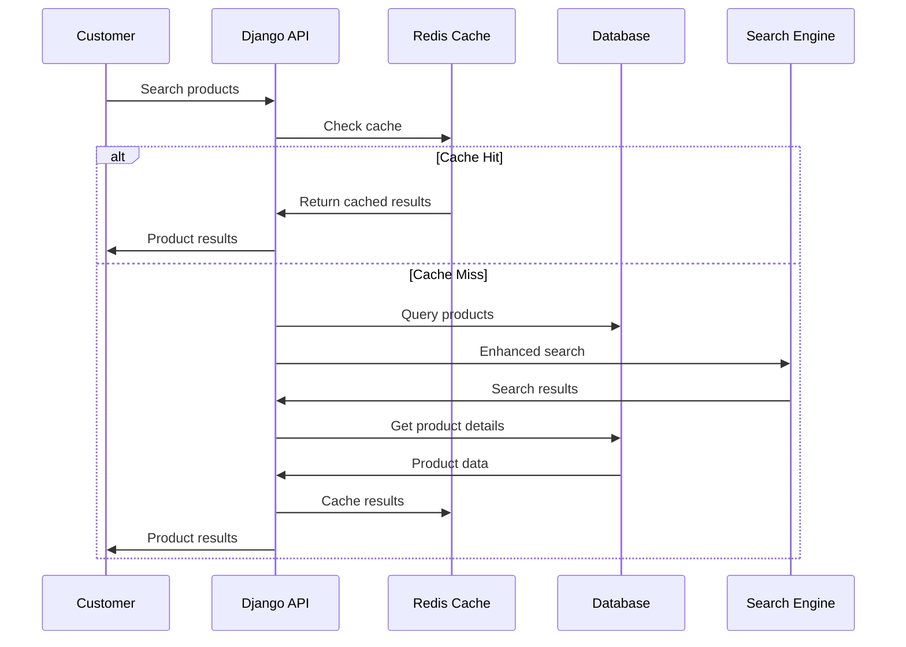

## 🔌 API Design

### RESTful API Structure

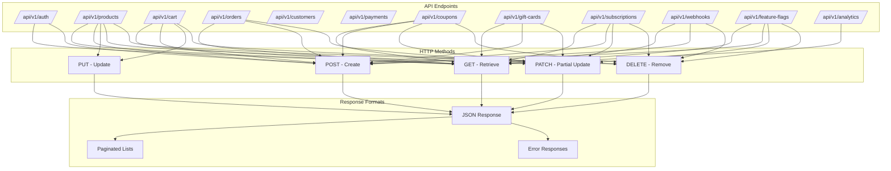

### Authentication & Authorization

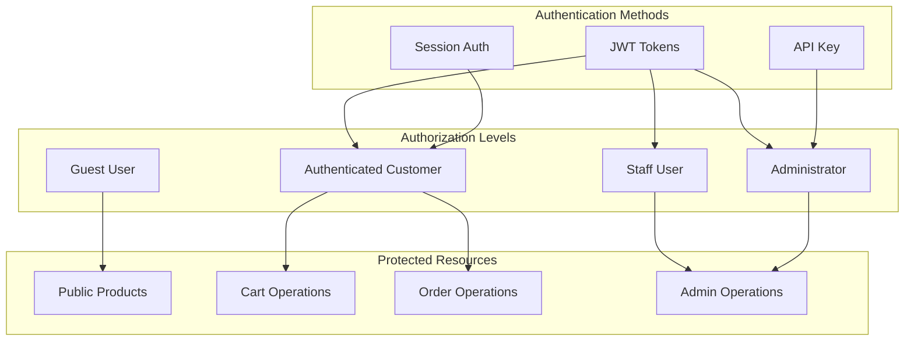

## 🗄️ Database Design

### Entity Relationship Diagram

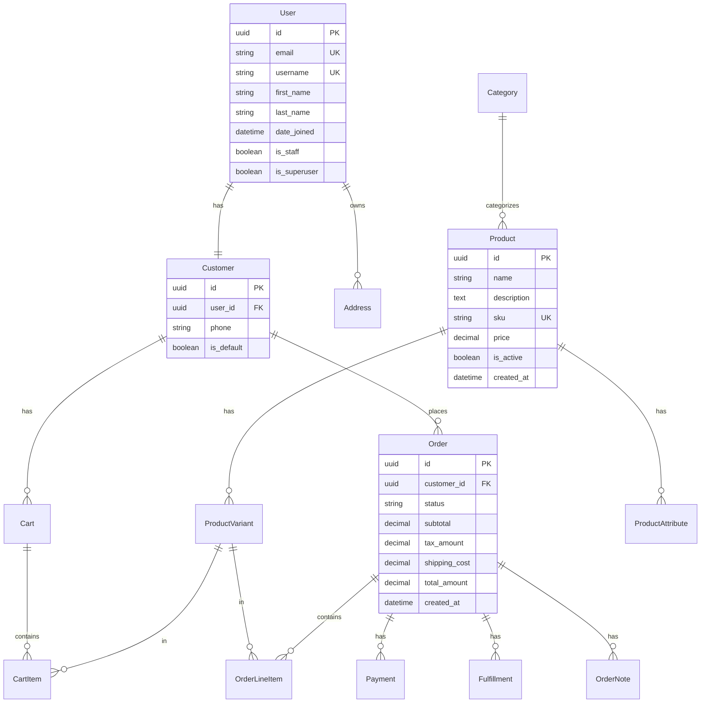

### Database Indexes Strategy

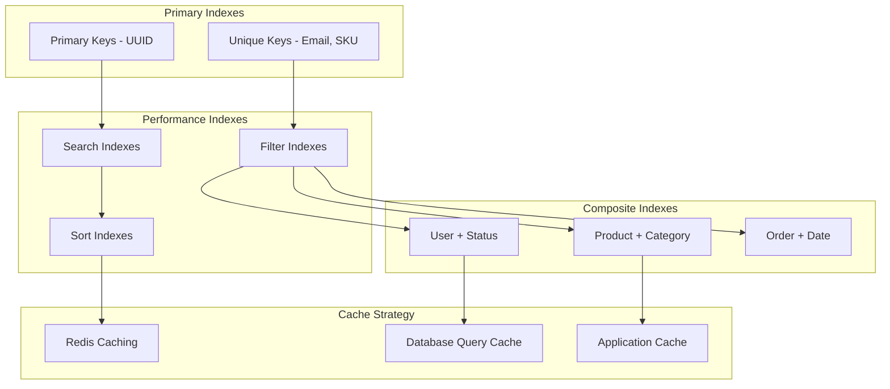

## 🔒 Security Architecture

### Security Layers

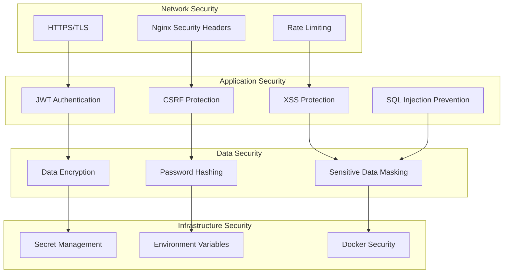

### Permission System

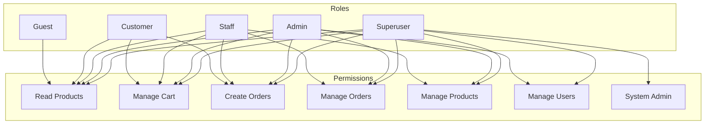

## 🚀 Deployment Architecture

### Container Architecture

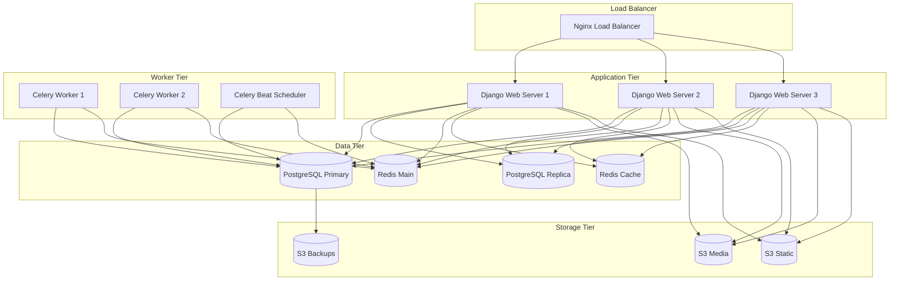

### Deployment Environments

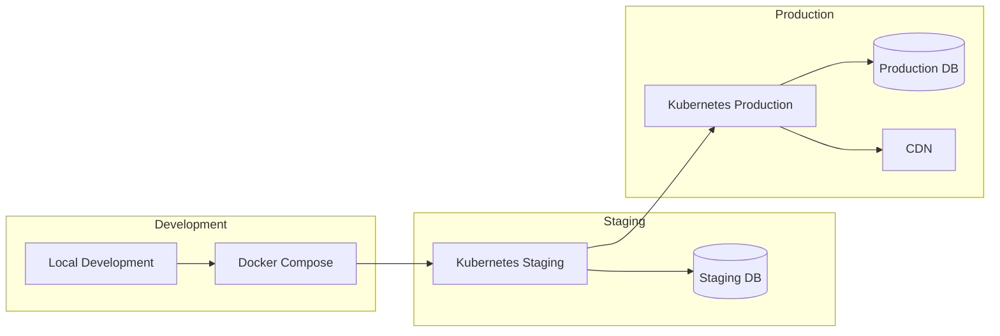

## 📊 Monitoring & Observability

### Monitoring Stack

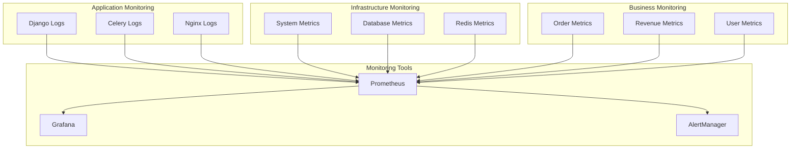

## 🧱 Service Layer Pattern

Controllers are kept thin. Domain logic lives in dedicated service classes that sit between the HTTP controller and the Django ORM.

### Key Service Classes

| Service | Module | Responsibility |
|---|---|---|
| `OrderService` | `orders/services.py` | Create orders, apply discounts, update status |
| `CartService` | `cart/services.py` | Add/remove items, recalculate totals, merge carts |
| `CouponService` | `coupons/services.py` | Validate and redeem promo codes |
| `GiftCardService` | `gift_cards/services.py` | Issue, redeem, and track gift card balances |
| `SubscriptionService` | `subscriptions/services.py` | Create and manage Stripe Subscription lifecycle |
| `WebhookService` | `outbound_webhooks/services.py` | Dispatch events and manage delivery retries |

### Service Layer Flow

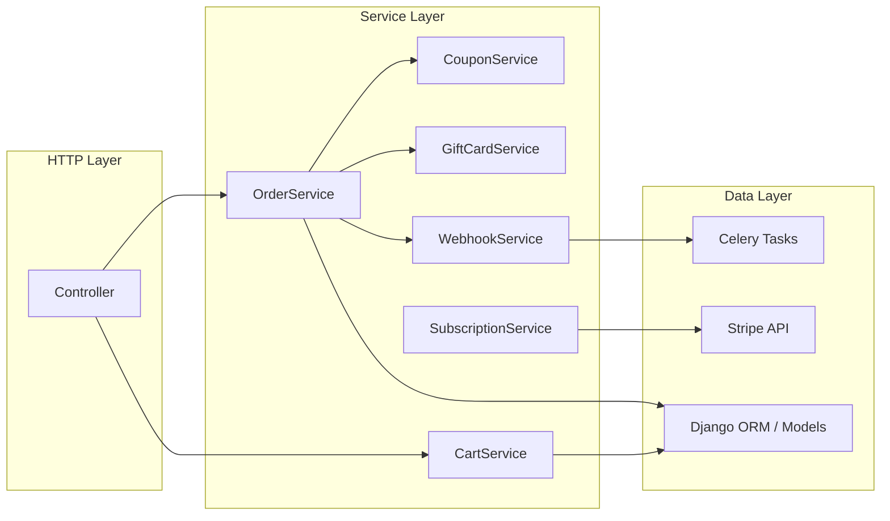

### Controller Decorator Pattern

Controllers use a composable decorator stack for cross-cutting concerns:

```python
@api_controller("/orders", tags=["Orders"])
class OrderController:
    @http_post("", response={201: OrderSchema})
    @handle_exceptions()        # structured error responses
    @log_api_call()             # request/response logging
    @require_authentication()   # JWT guard
    def create_order(self, request, payload: CreateOrderSchema):
        return 201, OrderService.create(request.user, payload)
```

Available decorators (defined in `api/utils/`):

- `@handle_exceptions()` — catches exceptions and returns structured HTTP errors
- `@log_api_call()` — logs request metadata and response status
- `@cached_response()` — Redis cache with configurable TTL and namespace
- `@paginate_response()` — standardised paginated list responses
- `@require_authentication()` — enforces valid JWT
- `@require_admin()` — restricts to staff/superuser roles

## ⚙️ Background Task Architecture

Long-running and side-effect work is offloaded to Celery workers via Redis as the broker.

### Task Categories

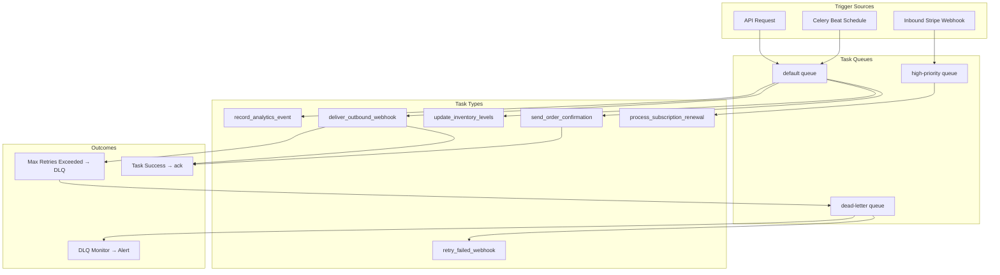

### Dead-Letter Queue (DLQ) Pattern

Tasks that exceed their retry budget are routed to the `dead-letter` queue rather than silently dropped. A separate Celery Beat job polls the DLQ, emits a structured log entry (picked up by the OpenTelemetry collector), and optionally requeues after manual inspection.

```python
# Outbound webhook delivery with DLQ fallback
@shared_task(
    bind=True,
    max_retries=5,
    default_retry_delay=60,
    queue="default",
)
def deliver_outbound_webhook(self, webhook_id: str) -> None:
    try:
        WebhookService.deliver(webhook_id)
    except Exception as exc:
        if self.request.retries >= self.max_retries:
            deliver_outbound_webhook.apply_async(
                args=[webhook_id], queue="dead-letter"
            )
            return
        raise self.retry(exc=exc)
```

### Celery Beat Scheduled Tasks

| Task | Schedule | Purpose |
|---|---|---|
| `process_subscription_renewals` | Every hour | Trigger due subscription charges |
| `expire_gift_cards` | Daily | Mark expired gift cards inactive |
| `flush_analytics_buffer` | Every 5 min | Write buffered events to DB |
| `poll_dlq` | Every 15 min | Alert on dead-letter accumulation |

This architecture documentation provides a comprehensive overview of the Django Ecommerce API system design, ensuring scalability, maintainability, and performance for a modern e-commerce platform.
